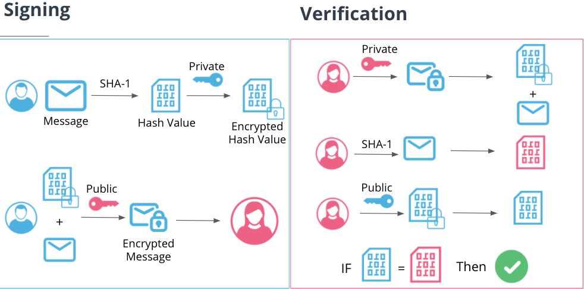
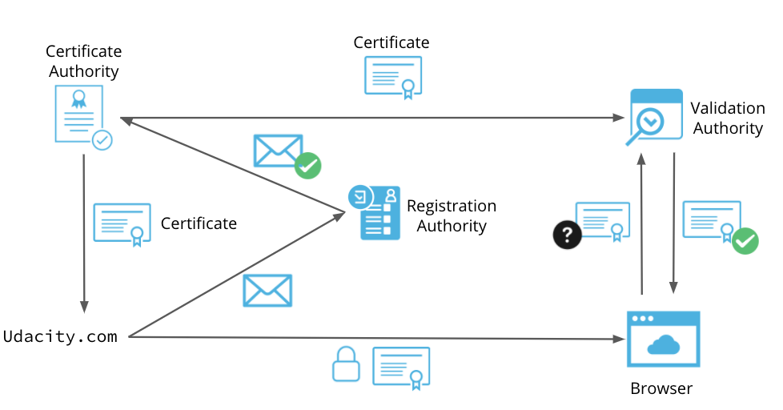

# Security Engineering Fundamentals

## Security Principles

There are four principles:

* CIA Triad
* Authentication, Authorization, Non-Repudiation
* Principles of secure design
* Security strategies

A security mindset: how can I break this system?

As a professional, you will evaluate risk based on the potential impact they may have on one of these three principles. That evaluation will drive your strategy for designing, and implementing a remediation plan.

### CIA Triad

* **confidentiality**: it is **keeping data secret or private**, in theory. In practice, it is **controlling access to prevent unauthorized disclosure**. Employee data, for instance, needs to be kept private and it should only be accessible by certain members of HR. Therefore, any access outside constitutes a breach of confidentiality.

* **integrity**: it is **ensuring the legitimacy of data so it can be trusted**, in theory. In practice, it means **no unauthorized modification or deletion**. Information must remain integral, without unauthorized modifications.

* **availability**: ensuring networks, systems, and applications are up and running. Denial of service (DoS) is a common vulnerability that affects availability of a service. Even though availability seems less obvious than confidentiality and integrity, it is equal important. Consider the healthcare industry or airline systems, for instance.

**To think**: not to fall in the trap assuming breaches to these principles **only occur by a malicious third party**. **A breach can occur by a malicious third party or by mistake of an authorized party**. 

**To think**: although each of the TRIAD is important for information security, **depending on the company the priority may vary**, and for that the impact also may vary. 

**To think**: **confidentiality**: keeping data secret or private; **integrity**: ensuring the data can be trusted; **availability**: ensuring networks, systems, and applications are up and running.

**To think**: bad performance does or does not violate availability principle? If the system is up and running, but unusable is it still considered available? What is our threshold for unusable? Is it some percentage of loss of expected performance? **It is important to consider what constitutes a security issue**. **Perhaps degrade in performance can be indicative of an attack, or perhaps it's merely a system issue**.

**To think**: working for a large eCommerce site, it happened an error that marked down the newly released video game system by 50%. Instead of $60, the game is selling for $30! As a result, the number of visits to your website increased substantially, and this caused an outage. Which security principles would this violate? **Integrity and Availability**.

### Authentication and Authorization

**Although authentication and authorization go hand-in-hand, they are not the same**. Buy they complement each other within their differences.

**Essentially, authentication is a confirmation of the identity of a user. Who are you? Are you who you claim to be?**

#### SFA, DFA, and MFA

The process of entering a password is known as a factor of authentication.

Authentication factors:

* **knowledge**: something you know. common form is a password or a pin.

* **possession**: something you have physically with you. common form is a one time pin, generated via text message or mobile APP. it could be a physical card, or smart card as well.

* **inherence**: something you are. it is a characteristic that is unique to you. common form is a fingerprint, hand-print, facial recognition.

* **location**: where you are. the most common is authentication based on geo-location IP address. For instance, you just access an ATM in USA and then two minutes later you access other in France. It could indicate of an unauthorized authentication.

* **behavior**: something you do. some mobile lock screens can require the user to draw a specific pattern.

Single, dual, and multi-factor authentication are all important forms of authentication. **It is important consider that more types of authentication increase security but increase complexity of the system as well.**

#### Authorization

It determines what an authenticated user can and cannot do.

**In a multi-tenant system**, data is commingled with other user's data. Meanwhile, in a single-tenant system, your data is in a completely isolated environment. But single tenant is not commonly used in consumer SaaS-based APP.

In a online baking, for instance, authorization is what stops you from being able to view other peoples account balances. Authorization is important in all systems, even single tenant ones. **Authorization determines what different levels of users can do on the system**.

#### Non-repudiation: to not allow someone to deny something

In information security, non-repudiation is related with digital signature, which is a digital signature that proves the identity of the author. We can sign an email to prove we are the author. Repudiation means to deny something, so if a document has authentication, or a user in a system, we can identify the user, and he does repudiate anything. Then, **we must ensure that a person performed the action (transfer money, for instance)**. **Authorization ensures that a user can only perform actions they are supposed to perform**.

In a transfer money scenario:
1. Authentication: login
2. Authorization: account I own
3. Non-repudiation = AuthN + AuthZ

**A strong confidence in authentication and authorization, we can have strong confidence in non-repudiation.**

A little more about Non-repudiation: someone **cannot claim they did not do something**. A user **cannot pretend they didn't do an action they did**. If we cannot trust the veracity of documents, messages, or any digital information, then how can we possibly rely on them for even trivial functions?

**In a healthcare scenario**, think about it: what would happen if, as a medical professional, you can't trust the healthcare data for your patients?

* **Without Authentication, anyone could access the server!**
* Everyone's messages could become public.
* **Without proper authorization** a user can access any other users’ email.
* **There is no privacy**.
* **Without Non-Repudiation**, **trust in messages and documents disappears**.
* The inability to trust the veracity of a message or document isn't just an inconvenience, it could be disastrous. Just think of the impact on the world if we couldn't trust that the message or document hasn't been changed. This is why digital signatures are so important.

The last approach:

* **authentication**: without proper Authentication, Anyone could access the email server.
* **authorization**: without proper authorization, a user can access any other users' email. 
* **non-repudiation**: The inability to trust the veracity of a message or document isn't just an inconvenience, it could be disastrous. Just think of the impact on the world if we couldn't trust that the message or document hasn't been changed. This is why digital signatures are so important.

#### Principles of Secure Design and Establishing Security Requirements

**Secure design is a proactive security approach**, which is the process of **building an application that has been designed with security in mind** from the ground up. It is opposed to a more reactive approach, in which the attempting to secure the APP occurs after it has been developed.

One of the most important secure principle design is OWASP ((Open Web Application Security Project) 10, based on top ten web application threats.

1. **Minimize Attack Surface**: it is **restricting the access** of functions within an application;
1. **Establish Secure Defaults**: by default, an **out of the box application** may be sent with **low security level to ensure it functions properly**. Applications are set to a high level of security out of the box. If a user needs to decrease the level, they must make a conscious decision to do so.
1. **Principle of Least Privilege**: the user must have the **minimum amount of privileges required to perform a specific task**. **Services must take this principle as well**.
1. **Defense in Depth**:
1. **Fail Securely**: **Errors shouldn’t have unintended consequences! Errors shouldn’t affect unrelated systems; Errors shouldn’t reveal sensitive data.**
1. **Don't Trust Services**: **be skeptical of third party services; be skeptical of incoming data, even if that data originates from a trusted source;**
1. **Separation of Duties**: in a bank, not everybody has access to the vault; and the vault has two parts to open him, and not the same person has the two. The user who wants perform the act, has an approval before the action, that should be done by a different person.
1. **Avoid Security by Obscurity**: **if an application has pieces that may hide to be security, so it isn’t security.**
1. **Keep Security Simple**!
1. **Fix Security Issues Correctly! Understand the root cause!**

**To think about**: Even though OWASP is focus on securing WEB APP, the principles can be applied to other functional areas as well.

**To think about**: Why is it important to establish standards for security practices as opposed to informing and allowing teams to decide for themselves? **It is important to establish standards for security practices because in the processing of development any detail must be forgot. The standards help the team to decide how to act an any situation**.

**To think about**: As the security expert, it is your job **to understand risk relative to the tolerance of your company**. Additionally, if individual teams are meant to determine the solution to a security problem, you may have to manage several different security solutions. Let's use code scanning for example. You've asked that all engineering teams perform code scanning. What happens if they all decide to use different tools? How do we aggregate reporting? Are we sure the tool is appropriate, etc. It's important to define security requirements, but you should go a step further and recommend solutions as well.

**To think about**: An engineering team has brought to your attention a new application that they have built. This application uses a MySQL database as the back-end storage. They recently heard you discussing the principle of least privilege and are concerned that **their design is overly permissive**. What recommendations would you make to the team to ensure the principle of least privilege is followed for the DB server? **Some points**: **No direct database access for users**; **for application access, create a system user specific to the application**. The **system user only has access to perform the necessary functions of the application** (if the application server is compromised, the attacker will be able to access the database server as that user). **Do not run as root or admin**. **Grant granular access to the tables within the database**. For instance, **the login application only needs access to the user table, not the entire database**.

#### Security strategies

It is critical for any organization to set a script for how you improve your security posture. The strategy defines the overall direction of the security department as well as establishes the organization’s risk tolerance. **This strategy is outlined via policies**.

* **policies**: a formal written statement. States what a person can and cannot be done. 
* **standards**: mandatory set of actions or rules that support the policy.
* **procedures**: step-by-step process for achieving a mandate.
* **guidelines**: non-mandatory set of best practices or recommendations how to adhere to a policy, but has flexibility.

In general, **policies and standards are considered mandatory**. **Procedures and guidelines are optional**, **but provides support for adherence to the mandatory**.

**To think about**: enforcement, password policy, for instance. Policy is a high-level document and must be easy to understand. It will dictate at a high level the requirements for passwords: all user accounts must have a password. It must meet complexity requirements, must be changed on irregular frequency, etc. **It is clear that we didn’t specify the rules.** **The rules for the policy will be defined in the standard**. The standard will detail the complexity requirements such as it needs to be at least 12 characters. **Procedures will detail how a user changes their password**. It can provide step-by-step instructions on how you can remain in compliance. **Guidelines are non-mandatory**, **but provide guidance and best practices related to the policy**. **None of this work matters if users continue their bad habits, we must enforce our policy.**

**To think about**: communicate, not just simply publish policies. Employ technical controls to ensure compliance. Verification can be done by audits. The audit’s role is to verify that your policies are being enforced. For instance: SOC, ISO 27.001.

**To think about**: Why security strategy is important? Why isn't it enough to just solve security problems with tools or proper design? **Security strategy is important because it is a strategy, that is, we plan and design security criteria that are needed in our organization.** In this way, **we reduce unforeseen situations and improvised solutions**. I think the four steps (policy, standards, procedure, guideline) are very useful to establish security strategies. After that, **it is important communicate and educate the users about the strategies**.

**To think about**: many users are not following secure practices. Design a strategy for solving these systemic issues. Policy: high level requirements for passwords, security level to save password. Standards: don't use dictionary words as passwords, instead to mix syllables of the words and create a new one with at least 10 characters. Don't write passwords on pieces of paper and don't share passwords, instead use a password manager and keep it safe. Procedures: how to define a passwords: choose five words, for instance, mythology, statistic, avocado, river, moon. Then, based on them, make a new word at least 10 characters: mystavrimo. It is recommended change the case of some letters, for instance: mYstavRimo. And add some special character: !mYstav%Rimo. Use a password manager like Google Password Manager. Guidelines: in an inconstant periodicity, select another five words and change the password. A few strategies: Create a password policy based on industry best practices.; Create an education or awareness campaign. Inform users of the new policy; Work with IT teams to enforce adherence based on the technical capabilities of the authentication system (i.e. forcing strong passwords, rotation, etc); Provide tools to enable users to comply with the requirements. For example, providing a secure password vault option can obviate the need for users to write passwords down or store via non-secure methods (text files); Conduct periodic audits to ensure compliance.

### Practical Cryptography

* **Big Picture for developing your intuition about cryptography**: **Encryption is the foundation for the trust** we have in digital systems. Without this foundation, nearly all of what do with computers wouldn't be possible.

* **encryption**: process of scrambling information so that it can only be read by someone with the ability to decrypt the information. **This is a two way process (encrypt and decrypt)**. The **cipher** (encryption key) is the procedure one must follow in order **to convert the information from plain-text to cipher-text**. The main aspect is that encryption is reversible, and it distinct encryption from hashing.
    * **symmetric encryption**: **one key, which is used both encrypting and decrypting**. In this case we have **a private key cryptography**. **Less overhead, data storage**
    * **asymmetric encryption**: two keys, but one is used for encrypting and a different one is used for decryption. In this case **we have a public key cryptograph**. **Strong form of encryption, digital signatures, PKI**
* **hashing**: process of taking any input and converting it **into a fixed-length output**. Therefore, **hashing is irreversible**, even it is technically possible to reverse, but it really isn’t practically feasible. **A few characteristics about hashing**: **one way (irreversible)**, **output is a fixed-length**, **hash value is 100% unique to the input**. Hashing to store passwords: **we don’t use encryption to store password because of the risk of decryption (all you need is the key). This is a big risk**.

* **salt**: adding a unique value to the beginning or end of a value you intend to hash.
* **rainbow table**: it is **a precomputed database** of hash values and their corresponding plain-text passwords. **NIST SP 800-175B Rev.1**

**To think about**: **What is the proper ay of storing passwords**? It's important to make sure you're using the proper encryption strategy! **Hashing is the correct form since it is irreversible**. Encrypted secrets mean there is a method to reverse the encryption thus giving anyone with access to the key access to the plain-text secret. This includes external malicious actors who get access to the server, but also internal users who have access to the key. **Salting the hash prevents dictionary or rainbow table attacks and is the preferred method of storing secrets**. **You use Symmetric when speed is a concern**. Common case: storing data at rest, such as financial data or PII. You use Asymmetric when security is more important than speed. Common case: digital signatures.

### Signing, certificates, and PKI

* **signing**: **Ensures that the contents of a message has not been altered in transit**.
* **certificates**: a certificate is digital file that contains a public key along with other information that proves identity and ownership of that key.

* public key infrastructure (PKI)
    * certificate authority (ca): trusted third party that issues certificates
    * verification authority (va): verifies ownership of the certificates
    * registration authority (ra): verifies that the party requesting a certificate is legitimate

There are **a number of common issues associated with PKI**. Obviously, writing down a key is bad, but due to the length, it is not practical to write keys down so this practice isn't common.

* **key Rotation**: unlike certificates, **keys do not have an expiration date**. **Without that forcing function, you must change keys regularly**. This prevents someone from stealing the key and creating their own certificate to circumvent protections.
* **using outdated protocols**: **there have been several iterations of secure protocols**. As **vulnerabilities are found in these protocols**, it is important to update them accordingly.
* **key Storage**: **store keys in a secure centralized solution such as Vault**. This will provide protection and auditing for users who access the keys.
* **human error**: **misconfiguration or improper handling of certificates and keys can cause widespread issues**.
* **insufficient key length**: **can be vulnerable to brute force attack**.

* We use encryption in communication to protect the **confidentiality and integrity** of our messages.

### TLS/SSL

*Widely used protocol for establishing encrypted communication between systems.
    * **Secure Socket Layer (SSL)**: encrypt communications.
    * **Transport Layer Security (TLS)**: successor to SSL and currently the standard for encrypted communications. PKI is what makes the TLS process possible (TLS requires trust, PKI creates trust)

TLS
1. First, the client sends an unencrypted message to the server requesting an encrypted session.
1. The server responds by sending its certificate, which (as we learned earlier) contains its public key.
1. The client verifies the certificate
1. The client generates a ‘pre-master’ key
1. The client uses the public key from the certificate to encrypt the ‘pre-master’ key and then sends it to the server.
1. The server (using its private key) decrypts the premaster key
1. Both the client and the server use the premaster key to create a shared secret key
1. The client sends a message to the server which is encrypted by the shared secret key
1. The server decrypts the message using the shared secret key and verifies the message.
1. The server then sends back a message encrypted with the shared secret key to confirm everything is okay.
1. We have now established a secure session and can exchange messages encrypted using a single, shared key.

**To think about**: SSL Striping is the process of forcing a connection to use HTTP instead of HTTP/S. This enables an attacker to sniff traffic (MitM) and view all communication in plaintext. A possible prevention technique would be to enable HSTS.

